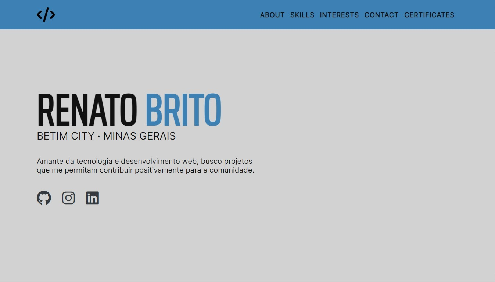

# Renato Brito / Web Developer 👋🏽

## Sobre

Nascido em Salvador, meu primeiro contato com programação foi
através do banco de dados relacional **MySQL** em 2013. Infelizmente, não pude dar continuidade aos estudos na
época, devido a questões pessoais. Em 2019, ingressei na faculdade
e conquistei uma vaga no curso de
**Tecnólogo em Análise e Desenvolvimento de Sistemas**
na **Anhanguera**. Avancei por três semestres, mas as
adversidades trazidas pela pandemia do
**COVID-19** resultaram em desemprego, impedindo-me de
concluir o curso. Atualmente, atuo como **autodidata**,
focando meus esforços no estudo de diversas linguagens e na
aplicação de **ferramentas relevantes** para o
**Desenvolvimento Web**. Estou comprometido em
aprimorar minhas habilidades e superar os desafios para alcançar
meus objetivos na área.

### Linguagens

- HTML, CSS, JavaScript

### Ferramentas

- Visual Studio Code, Cmder, Notion

### Setup

- Laptop Dell Series 3000 - i3 2GB RAM 1T HD

## Objetivos :dart:

Sonho em desbravar o mundo desde criança. Acredito que a tecnologia
pode proporcionar voos altos. Abre um mundo de possibilidades, nos
leva a conhecer pessoas engajadas no mesmo processo de aprendizado e
conquista de objetivos mútuos. Quero participar de projetos onde eu
possa lapidar minhas habilidades, e também contribuir com a
comunidade.

### Me encontre nas redes

- [Github](https://github.com/rbdev92)
- [Linkedin](https://www.linkedin.com/in/renatobrito92/)
- [Discord](https://discord.gg/#8522)
- [Email](mailto:dev.renatobrito@gmail.com)
- [Instagram](https://instagram.com/rbdev92)

### Estrutura de pastas

portfolio/
|-- assets/
| |-- css/
| |-- images/
| |-- js/
|-- index.html
|-- README.md

### Fontes

[Google Fonts](https://fonts.google.com/)

`'Inter', sans-serif;`
`'Open Sans', sans-serif;`
`'Saira Extra Condensed', sans-serif;`

### Cores

`--bg_color: #d2d2d2;`
`--color_blue: #3c80b4;`
`--color_white: #fff;`
`--color_black: #111;`
`--color_gray: #343a40;`

<!-- https://adevait.com/blog/workplace/7-soft-skills-developers-2019# -->
